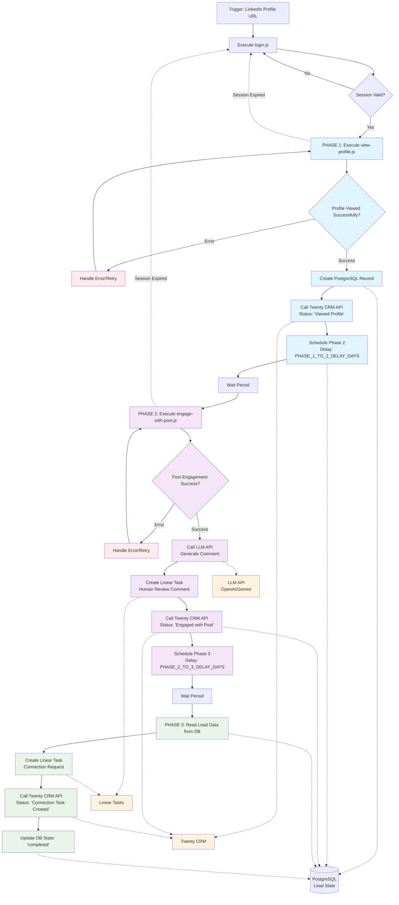

# N8N Automation Workflow Diagram

This mermaid diagram illustrates the complete 3-phase LinkedIn lead warming automation workflow where n8n orchestrates all business logic while Puppeteer scripts handle only browser interactions.

## Workflow Phases

### Phase 1: Profile View (Blue)
- Execute view-profile.js script
- Create PostgreSQL record
- Update Twenty CRM with "Viewed Profile" status
- Schedule Phase 2

### Phase 2: Post Engagement (Purple)
- Execute engage-with-post.js script
- Generate personalized comment via LLM
- Create Linear task for human review
- Update Twenty CRM with "Engaged with Post" status
- Schedule Phase 3

### Phase 3: Connection Request (Green)
- Create Linear task for connection request
- Update Twenty CRM with "Connection Task Created" status
- Mark workflow as completed

## Key Components

- **Orange nodes**: External systems (Twenty CRM, LLM API, Linear)
- **Red nodes**: Error handling and retry logic
- **Dotted lines**: Session management and database operations